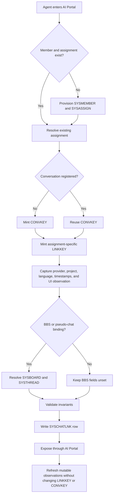
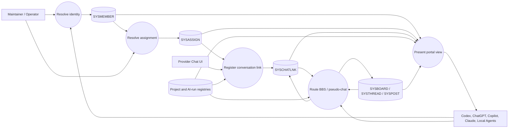

# AI Agent Assignment Link Maintenance Manual V1

Operator manual for the `SYSCHATLNK` X64 crosswalk that connects AI agents,
governed assignments, provider conversations, LabTalk projects, AI runs, UI
observations, and optional AI-BBS/pseudo-chat threads.

Contract: `docs/contracts/AI_AGENT_ASSIGNMENT_LINK_CONTRACT_V1.md`

Schema: `dottalkpp/data/schemas/syschatlnk_v1.schema.json`

Portal section: `portal.agent_assignment_links`

Owning lifecycle: AI Systems Integration / LabTalk AI Portal. Change class: C2.

AIF lane: `AIF-086`. Contribution run: `AIPR-20260816-001`. Contributing agent:
`member.ai.codex.local`; current steward: `member.ai.claude.cowork`; owner:
`member.derald`.

## 1. Operational status and boundaries

Current supported state:

- the 35-field UTF-8 X64 schema is source-defined;
- the current development runtime validates the schema and creates, opens,
  writes, and reads a disposable `SYSCHATLNK` proof table;
- the AI Portal exposes the contract, this manual, schema, relationship routes,
  executable regression, and accepted proof transcript;
- `LINKKEY`, `CONVKEY`, identity, assignment, language, and timestamp readbacks
  have runtime proof.

Not yet a supported production claim:

- no production writer or synchronization service is registered;
- no live `SYSCHATLNK` catalog location is authorized;
- declared CDX indexes are plans emitted to sidecars, not proven production
  index materialization;
- the soft relations are not database-enforced foreign keys;
- provider UI ordering is observed state, not an authoritative ordering API.

Do not copy the disposable proof DBF into identity or BBS metadata. Do not edit
`dottalkpp/data/metadata/bbs/` as a shortcut. Production activation requires a
separate reviewed persistence integration and migration gate.

## 2. Identity model

The row grain is one agent assignment participating in one local conversation.

| Identifier | Scope | Rule |
| --- | --- | --- |
| `ID` | Physical row | 64-bit local row identifier |
| `LINKKEY` | Agent-assignment/conversation binding | Globally unique and immutable |
| `CONVKEY` | Shared conversation | Identical across every participating agent row |
| `MEMBERID`, `MKEY` | Agent identity | Must resolve to the same `SYSMEMBER` |
| `ASSIGNID` | Governed assignment | Must resolve to `SYSASSIGN` and belong to `MEMBERID` |
| `WORKID` | Work projection | Must equal `SYSASSIGN.WORK` when both are nonzero |
| `PROJKEY` | Portal project | Must resolve to `projects.yaml:projects[].id` |
| `RUNID` | Evidence/run | Resolves to the AI run registry when populated |
| `BBSTHRID` | BBS thread | Resolves to `SYSTHREAD.ID` when populated |

Never construct `LINKKEY` or `CONVKEY` from a title, path, account name, email
address, UI position, or provider display string. Preferred forms are opaque
locally minted identifiers:

```text
LINKKEY = alink:v1:<uuid>
CONVKEY = conv:v1:<uuid>
```

Adding another agent to an existing conversation creates another row with a new
`LINKKEY`, its own `MEMBERID` and `ASSIGNID`, and the existing `CONVKEY`.

## 3. Process flow diagram

Standalone maintained source:
`labtalk/diagrams/ai_agent_assignment_link_pfd_v1.mmd`.



## 4. Data flow diagram

Standalone maintained source:
`labtalk/diagrams/ai_agent_assignment_link_dfd_v1.mmd`.



## 5. Field maintenance groups

### 5.1 Immutable identity fields

After insertion, do not change:

- `ID`
- `LINKKEY`
- `CONVKEY`
- `MEMBERID`
- `MKEY`
- `ASSIGNID`
- `CREATEDAT`
- `VFROM`

If an assignment is wrong, invalidate the row and create a corrected row with a
new `LINKKEY`. Do not rewrite history to make an old assignment appear correct.

### 5.2 Agent and provider description

- `PROVIDER`: provider family, such as `openai`, `github`, `anthropic`, or
  `local`;
- `PRODUCT`: Codex, ChatGPT, Copilot, Claude, or local product name;
- `MODEL`: provider/model observation, not an identity key;
- `LOCALE`: BCP 47 natural-language tag;
- `CODELANG`: primary task language such as `cpp`, `python`, `sql`,
  `dotscript`, or `mixed`.

Provider or model changes update the descriptive fields and `MODAT`/`OBSAT`.
They do not create a new row unless the governed assignment or conversation
identity changes.

### 5.3 Provider-native references

`SRCPROJ`, `SRCCHAT`, `SRCTHREAD`, and `PARENTID` store provider-native opaque
identifiers. Preserve the exact provider value when available. Do not treat a
blank value as evidence that the provider has no such object; it may mean the
provider did not expose it.

### 5.4 UI observation fields

`TITLE`, `CWD`, `UISECT`, `UIPOS`, `PINPOS`, `PINNED`, and `ARCHIVED` are a
snapshot of a provider UI. A rename, drag, pin, archive, sort, or project move
may update them. Every refresh must update `OBSAT`; update `MODAT` only when the
provider reports or the observer confirms a modification.

Never use UI position to infer creation order. Never use the title as a join.

### 5.5 Time and row-state fields

All time fields are UTC Unix epoch seconds:

- `CREATEDAT`: provider creation time or first observation;
- `MODAT`: last provider modification, with `MODAT >= CREATEDAT`;
- `OBSAT`: snapshot observation time, normally `OBSAT >= MODAT`;
- `VFROM`, `VTHRU`, `ROWVER`: identity-compatible bitemporal row state.

`VTHRU=0` means current. `STATUS` values are `0=active`, `1=closed`, and
`2=invalidated`. Increment `ROWVER` for every maintained row version.

### 5.6 Security classification

`SENSCLASS` is mandatory. Use a maintained classification vocabulary before a
production writer is approved. Until that vocabulary is registered, use
`internal` for local provider IDs, titles, and paths. Never store authentication
tokens, authorization codes, prompt secrets, or message bodies in
`SYSCHATLNK`.

## 6. Standard operating procedures

### 6.1 Register the first agent in a conversation

1. Resolve the agent in `SYSMEMBER` by `MKEY`.
2. Resolve an active `SYSASSIGN` row for that member and work context.
3. Validate `SYSASSIGN.MEMBERID == SYSMEMBER.ID`.
4. Mint one new `CONVKEY` and one new `LINKKEY`.
5. Capture provider-native identifiers without transforming them.
6. Resolve `PROJKEY` from `labtalk/registries/projects.yaml`.
7. Set `LOCALE`, `CREATEDAT`, `MODAT`, `OBSAT`, `SENSCLASS`, `STATUS=0`,
   `VFROM`, `VTHRU=0`, and `ROWVER=1`.
8. Validate the row against Section 7 before insertion.

### 6.2 Add another agent to the conversation

1. Locate the existing conversation by `CONVKEY`.
2. Resolve the new agent's `SYSMEMBER` and `SYSASSIGN` rows.
3. Confirm no active `(ASSIGNID, CONVKEY)` row already exists.
4. Mint a new `LINKKEY`; reuse the existing `CONVKEY`.
5. Insert the new row with that agent's provider and UI observations.

Do not reuse another agent's `LINKKEY`.

### 6.3 Refresh project, title, or UI position

1. Locate the row by `LINKKEY`.
2. Confirm the observed provider chat still matches `SRCCHAT` or
   `SRCTHREAD`.
3. Update only the changed UI/provider projection fields.
4. Set `OBSAT` to the observation time.
5. Set `MODAT` when the provider reports a new modification time.
6. Increment `ROWVER`.
7. Confirm `LINKKEY`, `CONVKEY`, `MEMBERID`, and `ASSIGNID` are unchanged.

### 6.4 Bind a conversation to AI-BBS or pseudo-chat

1. Resolve the board using `SYSBOARD.BKEY` and record it as `BBSBOARD`.
2. Resolve the existing BBS conversation using `SYSTHREAD.ID` and record it as
   `BBSTHRID`.
3. Record the relevant AI run as `RUNID`.
4. Include `LINKKEY`, `CONVKEY`, and `RUNID` in structured handoff metadata.
5. Keep `SYSPOST.RUNID` populated for the corresponding BBS posts.

Do not create a parallel BBS conversation object for the same mapping. The
existing `SYSTHREAD` remains the BBS conversation authority. `board.worklog` is
a coordination surface; registries, contracts, proofs, and closeouts remain
authoritative.

### 6.5 Close, invalidate, or reassign

- Normal conversation closure: set `STATUS=1`, preserve all identifiers, update
  `MODAT`, `OBSAT`, and `ROWVER`.
- Erroneous or unsafe binding: set `STATUS=2`; do not delete the evidence row.
- Assignment change: close the old row and create a new row with a new
  `LINKKEY`. Reuse `CONVKEY` only if it is still the same conversation.
- Provider fork: preserve the source provider ID in `PARENTID`; mint a new
  `CONVKEY` when the fork is governed as a distinct conversation.

## 7. Validation and audit checklist

Before accepting a row:

- [ ] `LINKKEY` is nonblank and globally unique.
- [ ] `CONVKEY` is nonblank.
- [ ] `(ASSIGNID, CONVKEY)` is unique.
- [ ] `MEMBERID` and `MKEY` resolve to the same `SYSMEMBER`.
- [ ] `ASSIGNID` resolves to `SYSASSIGN`.
- [ ] `SYSASSIGN.MEMBERID == MEMBERID`.
- [ ] `WORKID` agrees with `SYSASSIGN.WORK` when both are nonzero.
- [ ] `PROJKEY` is registered.
- [ ] `LOCALE` is a valid BCP 47 tag.
- [ ] `CREATEDAT <= MODAT <= OBSAT`, unless a documented provider clock issue
  requires quarantine.
- [ ] `SENSCLASS` is populated.
- [ ] `RUNID`, `BBSBOARD`, and `BBSTHRID` resolve when populated.
- [ ] no token, secret, full prompt, or message body is present.
- [ ] UI fields are not being used as identifiers.

Conversation-level audit:

- every active row sharing `CONVKEY` represents a distinct assignment;
- each participant has its own `LINKKEY`;
- BBS-bound rows agree on the intended board/thread route;
- closed or invalidated assignments are not selected as active participants;
- timestamps and row versions move forward, never backward.

## 8. Proven maintenance commands

Run the registered X64 creation/readback proof from `D:\code\ccode`:

```powershell
python .\labtalk\portal\labtalk_portal.py --run-item agent_assignment_link.regression
```

Acceptance requires all five markers and portal `output_acceptance: accepted`:

```text
SYSCHATLNK_T1_LINKKEY:.T.
SYSCHATLNK_T2_CONVKEY:.T.
SYSCHATLNK_T3_ASSIGN:.T.
SYSCHATLNK_T4_LOCALE:.T.
SYSCHATLNK_T5_TIMES:.T.
```

Run the read-only portal truth audit:

```powershell
python .\labtalk\portal\labtalk_portal.py --audit
```

The regression creates and overwrites only the disposable `SYSCHATLNK` DBF and
DDL sidecars under the runtime's configured `TMP` path. It is not a production
migration and does not prove a live writer.

## 9. Failure handling

| Symptom | Likely cause | Required action |
| --- | --- | --- |
| Duplicate `LINKKEY` | key minting or replay defect | Reject the new row; preserve and investigate the existing row |
| Duplicate `(ASSIGNID, CONVKEY)` | same assignment registered twice | Reject duplicate; do not merge by title |
| Member/assignment mismatch | wrong assignment selected | Invalidate candidate row and resolve identity again |
| Same chat title, different provider IDs | titles are not unique | Keep separate until provider identity is reconciled |
| UI position changed | normal provider UI mutation | Update observation fields only |
| `MODAT < CREATEDAT` | provider conversion or clock defect | Quarantine; retain raw values outside production import evidence |
| Missing BBS thread | stale or incomplete route | Leave `BBSTHRID` unset; do not invent an ID |
| Missing run record | unregistered evidence link | Hold the `RUNID` update until the run exists |
| Portal says script is missing | incorrect registry `script` path | Restore the repo-relative DotScript path and audit again |
| Proof exits zero but markers fail | output acceptance failure | Treat as failed; inspect the full transcript |

Never repair identity drift by editing BBS posts or changing immutable keys.
Never delete a conflicting row before preserving evidence and determining which
source was authoritative at the time.

## 10. Backup, recovery, and retention

Until production activation, the schema, contract, registry, script, and proof
transcript are the durable artifacts; the TMP DBF is disposable.

Before a future production migration:

1. stop every approved writer;
2. resolve and record the exact production table path;
3. copy the DBF, memo, index, and sidecars as one timestamped set;
4. hash the set and record the hashes in the run evidence;
5. validate record counts and key uniqueness before mutation;
6. perform the migration against a copy first;
7. reopen and read back representative multi-agent, multilingual, BBS-bound,
   archived, and invalidated rows;
8. retain the pre-migration set until the closeout is accepted.

No recovery procedure may remint `LINKKEY` or `CONVKEY` merely to make a broken
index build succeed.

## 11. Schema and index change control

Any change to row grain, identifiers, required fields, timestamp semantics,
status values, language encoding, or relations is a contract change, not a
cosmetic schema edit.

Required sequence:

1. update the contract and this manual;
2. update `syschatlnk_v1.schema.json` or introduce a versioned successor;
3. update the disposable regression and required output markers;
4. run the regression through the portal;
5. run the portal audit;
6. record compatibility, migration, rollback, and evidence consequences;
7. obtain the required review before production activation.

The declared lookup plan covers `LINKKEY`, `(ASSIGNID, CONVKEY)`, `CONVKEY`,
`RUNID`, the BBS route, and the portal/UI projection. Do not claim index-backed
performance until physical index creation, reopen, lookup, uniqueness failure,
and stale-index recovery are runtime-proven.

## 12. Operator closeout

At the end of maintenance, record:

- affected `LINKKEY` and `CONVKEY` values without secrets;
- agent `MKEY`, assignment, project, and run identifiers;
- old and new status, timestamps, and `ROWVER`;
- BBS thread impact;
- validation results and proof transcript path;
- unresolved drift and the next gate.

Do not place credentials or private message bodies in the closeout. Do not
describe a disposable proof as production deployment.
