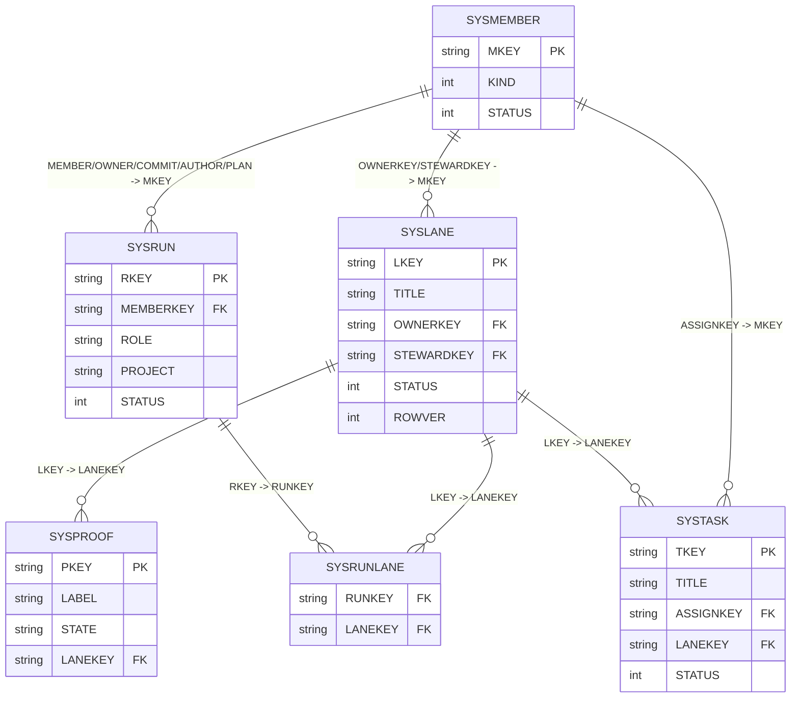
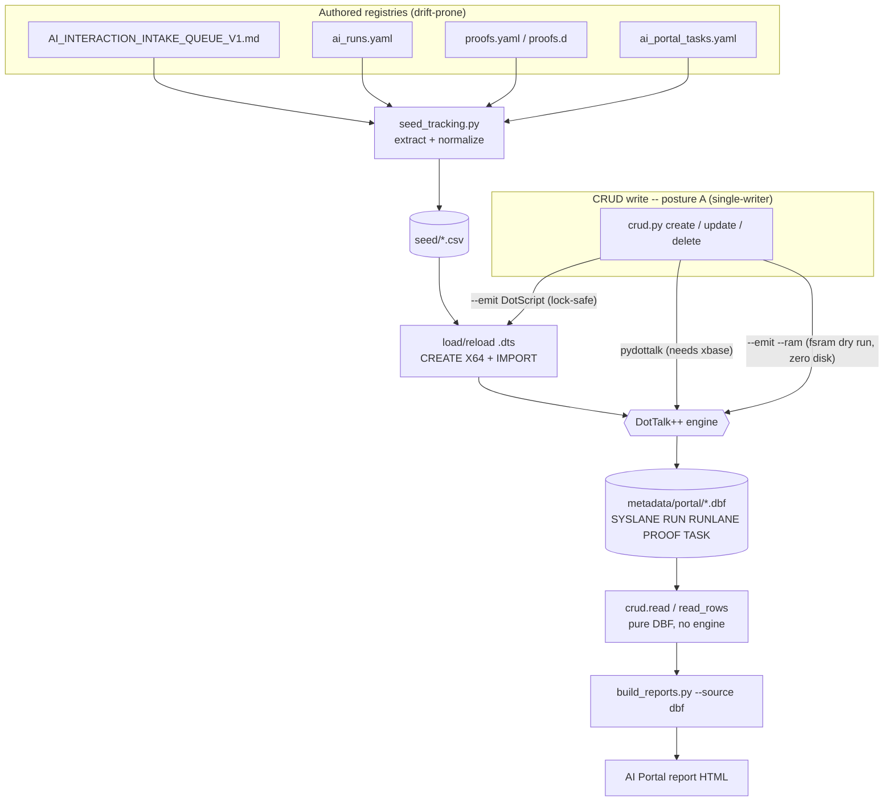
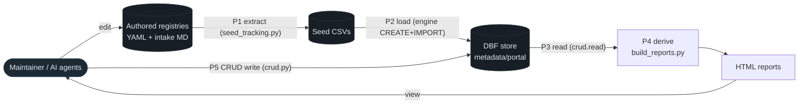

# AI Portal Tracking Dogfood -- ERD / PFD / DFD (AIF-089)

High-level diagrams of the DBF-native tracking layer and its dogfood pipeline
(built under AIF-086; command-drift lane AIF-088). Owning lane AIF-089 (diagrams /
documentation); claim host-side with `session_coordinator.py claim-aif` if tracked.

Key-FK note: cross-references are NATURAL KEYS (member `MKEY`, lane `LKEY`, run
`RKEY`), not numeric ids -- the tables are seeded from external authored data with
no engine ids, so `IMPORT` binds a key column 1:1 by name.

## 1. ERD -- entities and relationships (high level)

`SYSLANE` is the hub: a lane has many runs (via the `SYSRUNLANE` crosswalk), many
proofs, and many tasks; every attribution resolves to `SYSMEMBER` by key. Identity,
BBS, and rulings are adjacent subsystems (own catalogs) joined by the same `MKEY`.

## 2. PFD -- process flow (the dogfood pipeline + CRUD write)

Authored state flows left-to-right into the engine, which is the single writer;
reports DERIVE from the store, so a landed lane cannot be missing from a view.
The write side has three surfaces, all validated by the same registry.

## 3. DFD -- data flow (level 1)

Two data stores that drift (authored registries, seed CSVs) feed one store that
cannot (the engine's DBF), and every sink (reports, CRUD) reads through the engine
or its pure reader -- the derived-truth thesis drawn as a flow.
