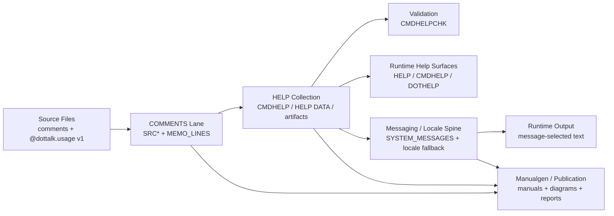

# Help, Comments, and Messaging Foundation v1

Status: foundation note
Scope: comments, help, cmdhelp, cmdhelpchk, messaging, locale, manualgen, publication/diagram layer

## Purpose

This note establishes the first solid architectural chain for DotTalk++ / x64base:

```text
source comments and @dottalk.usage
    -> comments evidence workspace
    -> help collection and HELP DATA
    -> validation/check surfaces
    -> runtime message selection and fallback
    -> manuals, diagrams, and educational publication artifacts
```

The goal is not to solve all localization now. The goal is to see how the system fits together, preserve the authoritative source contract, and identify where runtime language support should continue next.

## Core Decision

The help system is the first collection.

That means:

- source comments and `@dottalk.usage v1` remain the fragile but authoritative source layer
- the comments workspace preserves that source evidence
- `CMDHELP` and related builders collect and transform it into HELP-oriented artifacts
- `CMDHELPCHK` validates the collection
- messaging/locale should increasingly replace hard-coded runtime output with runtime-selected message text
- manuals, diagrams, and publication artifacts should sit above that pipeline, not beside it

## Layer Model



## Layer 1: Comments Are the Authoritative Source Contract

Comments should remain English-only in the source layer.

That is correct because:

- source comments are part of the codebase itself
- `@dottalk.usage v1` is the unique command contract surface
- the comments lane is evidence, not a translation target

Current lane evidence already says this clearly:

- `docs/maintenance/lanes/comments/COMMENTS_PIPELINE_MANIFEST_v1.md`
- `dottalkpp/data/comments`
- `dottalkpp/data/workspaces/comments.dtschema`

Known tables:

- `SRCFILE`
- `SRCBLOCK`
- `SRCLINE`
- `SRCUSAGE`
- `SRCCLASS`
- `SRCDISP`
- `SRCALIAS`
- `MEMO_LINES`

Practical rule:

- do not translate source comments
- do not weaken `@dottalk.usage v1`
- do preserve and harvest this layer so everything above it can rely on stable facts

## Layer 2: Help Is the First Collection

The help system is the first real collection layer because it gathers multiple sources and turns them into user-facing/help-facing structures.

Inputs already visible in the repo:

- command registry
- source `@dottalk.usage v1`
- command-local help/doc facts
- `dotref.hpp`
- `foxref.hpp`
- curated help rows
- shared standard messages

Relevant files:

- `src/cli/cmdhelp.cpp`
- `src/cli/cmdhelp.hpp`
- `src/cli/helpdata_cmdhelp_bridge.cpp`
- `src/cli/helpdata_cmdhelp_bridge.hpp`
- `docs/maintenance/lanes/help/HELP_CMDHELP_DOTREF_PIPELINE_NOTES_v1.md`

Important existing doctrine from the bridge layer:

- `@dottalk.usage v1` remains authoritative
- source-mined message/syntax facts are diagnostics and supplements
- shared standard messages are already treated as collectible artifacts

Current runtime boundary:

- the comments workspace preserves `SRC*` evidence for review and later regeneration work
- `CMDHELP BUILD` still collects from direct source mining plus direct usage-contract harvesting
- current HELP DATA generation does not yet consume the `comments` DBFs as its primary live input

That is the correct foundation for later language support because the message system can attach to a real collection layer instead of chasing ad hoc strings everywhere.

## Layer 3: Validation Must Stay Separate

`CMDHELPCHK` is not the help system itself. It is the checkpoint.

That matters because:

- collection and validation should not be conflated
- visibility in `CMDHELP` is not identical to visibility in `HELP /DOT`
- source facts, help data, and runtime help routing can drift independently

Relevant files:

- `src/cli/command_helpchk.cpp`
- `docs/maintenance/lanes/cmdhelpchk/CMDHELPCHK_MAINTENANCE_NOTES_v1.md`

Practical rule:

- comments preserve evidence
- help collects
- cmdhelpchk validates

This separation should remain intact while language support grows.

## Layer 4: Messaging and Locale Are the Runtime Selection Spine

Current runtime reality is already clear:

- `SET LANGUAGE`
- `SET LOCALE`

These currently behave as message-template selection, not full culture/region behavior.

Relevant code:

- `src/cli/cmd_set.cpp`
- `src/cli/cmd_msgmgr.cpp`
- `src/cli/message_catalog.cpp`
- `src/cli/command_output.cpp`

Current live seed tables:

- `dottalkpp/data/messaging/SYSTEM_MESSAGES.dbf`
- `dottalkpp/data/messaging/SYSTEM_MESSAGE_TEXT.dbf`
- `dottalkpp/data/locale/SYSTEM_LOCALES.dbf`
- `dottalkpp/data/locale/SYSTEM_LOCALE_FALLBACK.dbf`

This is enough to justify continuing the runtime message-selection path.

### What messaging should do now

- select locale-friendly runtime text
- enforce fallback rules
- validate placeholders and message identity
- provide report/check surfaces
- replace the most important hard-coded operator-facing text

### What messaging should not try to do yet

- localize command keywords
- become a full date/number/currency region engine
- force an all-at-once rewrite of every `std::cout`

## Layer 5: Manuals and Diagram/Publications Are the Educational Output Layer

This is where multilingual effort has the highest educational value.

The manualgen lane already models:

- section Markdown
- appendices
- media anchors
- publication manifests
- review queues
- published manuals
- MAN* catalog evidence

Relevant files:

- `docs/maintenance/lanes/manualgen/MANUALGEN_BLACKBOX_MANIFEST_v1.md`
- `src/cli/cmd_manual.cpp`
- `src/cli/cmd_bbox.cpp`

Practical rule:

- comments remain English-only evidence
- runtime messages become selectively locale-aware
- manuals and learning/publication artifacts are the primary multilingual target

This is the correct place to matriculate source facts and metadata upward into a graphic/documentation layer.

## Current Runtime Message Path: Real but Narrow

A real message-friendly runtime path already exists:

- `src/cli/command_output.cpp`
- `src/cli/command_output.hpp`
- `src/cli/message_catalog.cpp`
- `src/cli/cmd_set.cpp`
- `src/cli/cmd_help.cpp`
- `src/cli/cmd_display.cpp`
- `src/cli/cmd_go.cpp`

What that path already provides:

- runtime-selected locale text
- prefixed command messages
- centralized output routing
- shared message formatting

This is the right direction.

## Current Gap: Hard-Coded Output Still Dominates

Live inventory from `src/cli` excluding `.bak`, `.save`, and text artifacts:

- `202` live `.cpp` files still contain direct `std::cout` / `std::cerr` style output
- only `11` live `.cpp` files are currently on the message-aware `command_output` / `message_catalog` path

This means the architecture exists, but adoption is still early.

Top live direct-output concentrations currently include:

- `cmd_importsql.cpp`
- `cmd_workspace.cpp`
- `cmd_ersatz.cpp`
- `table_buffer.cpp`
- `cmd_codaysl.cpp`
- `cmd_sqlite.cpp`
- `cmd_simple_browser.cpp`
- `command_helpchk.cpp`
- `cmd_cnx.cpp`
- `cmd_projects.cpp`
- `cmd_memo.cpp`
- `cmd_relations.cpp`
- `cmd_pack.cpp`
- `cmd_ddict.cpp`
- `cmdhelp.cpp`

This is the core evidence behind the statement “we have a lot of cout hard coded.”

## What Fits Together Already

The good news is that the pieces are not random anymore.

They fit together like this:

### Source truth

- comments
- `@dottalk.usage v1`
- command-local contracts

### Collection

- `CMDHELP`
- HELP DATA / artifacts
- shared message artifact rows

### Validation

- `CMDHELPCHK`

### Runtime selection

- `SET LANGUAGE`
- `SET LOCALE`
- message catalog
- output router

### Educational publication

- `MANUAL`
- MAN* catalog
- documentation sets
- diagrams/publication reports

That is a coherent system. It is incomplete, but it is coherent.

## Where Work Should Continue

### 1. Protect the comments lane

Do not lose comment maintenance or weaken the unique source contract.

Near-term rule:

- comments stay English-only
- `@dottalk.usage v1` stays authoritative
- comments remain below HELP, not replaced by HELP

### 2. Make help and check surfaces message-aware first

Because help is the first collection, the first runtime migration should stay close to it.

Best first conversion targets:

- `cmd_help.cpp`
- `cmdhelp.cpp`
- `command_helpchk.cpp`
- `cmd_set.cpp`
- `cmd_msgmgr.cpp`
- `cmd_manual.cpp`
- selected startup/status lines in `shell.cpp`

Reason:

- these are inspection/report/help surfaces
- they shape operator trust
- they teach the rest of the system how to emit locale-aware text

### 3. Keep operator/runtime localization basic at first

Use the message catalog for:

- missing file
- unsupported locale
- no table open
- catalog validation/status messages
- selected startup/help hints

Do not begin with:

- full SQL/report/browser/localization coverage
- every niche command family
- every developer-only experimental command

### 4. Push multilingual energy upward into manuals and learning docs

After the runtime message core is credible, the larger audience payoff is:

- multilingual manuals
- translated educational docs
- curated translated help content
- diagram/publication layer outputs

That is the strongest audience-expansion move.

## Suggested Implementation Sequence

### Phase A: Preserve evidence

- stabilize comments harvesting
- stabilize `@dottalk.usage v1` consumption
- keep comments lane English-only and reportable

### Phase B: Stabilize help collection

- keep `CMDHELP` as the first collection layer
- keep `CMDHELPCHK` as separate validation
- make sure shared standard messages remain collectible artifacts

### Phase C: Migrate core runtime help/status text

- move selected `std::cout` help/status lines onto `command_output` + message catalog
- prove locale fallback through `SET LANGUAGE` / `SET LOCALE`

### Phase D: Expand selective runtime message coverage

- basic operational/runtime errors
- common status/warning/info text
- no broad command-grammar localization

### Phase E: Promote to educational publication layer

- manuals
- translated documentation artifacts
- curated multilingual help/learning outputs
- diagrams/publication reports

## Bottom Line

The right foundation is:

- comments are the English-only authoritative evidence layer
- help is the first collection
- cmdhelpchk is the validator
- messaging/locale is the runtime selection spine
- manuals and documentation are the main multilingual audience layer

The biggest technical gap today is not architecture. It is adoption:

- the message-friendly path exists
- but direct `cout` still dominates most live command code

So the next serious work is not to invent another subsystem. It is to migrate the help/inspection/report surfaces first, then expand runtime message selection outward from there.
