# DotTalk++ SDLC Diagrams v0

Status: draft diagram pack
Created: 2026-07-04
Purpose: visual view of DotTalk++ SDLC, subsystem status, proof gates, maintenance lanes, and PLDC boundaries

## Status Legend

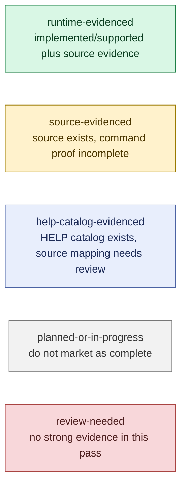

## DotTalk++ SDLC Ownership Map

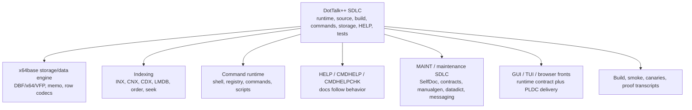

## SDLC Flow

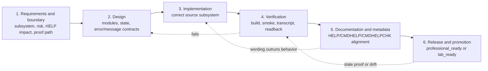

## Promotion Evidence Ladder

```mermaid
flowchart LR
    source["source_defined<br/>code or contract exists"]
    observed["runtime_observed<br/>behavior exercised"]
    documented["help_documented<br/>HELP/CMDHELP accurate"]
    validated["validated<br/>CMDHELPCHK/smoke/checker passed or classified"]
    pro["professional_ready<br/>safe for normal runtime use"]
    lab["lab_ready<br/>safe for LabTalk package"]

    source --> observed --> documented --> validated --> pro --> lab

    lab -. "LabTalk may package as real" .-> lt["LabTalk real"]

    classDef source fill:#fff2cc,stroke:#9a7a00,color:#4a3600
    classDef observed fill:#d9f7e5,stroke:#1d7f45,color:#0b3d20
    classDef ready fill:#dff5ff,stroke:#287c9b,color:#123b4a

    class source source
    class observed,documented,validated observed
    class pro,lab,lt ready
```

## Current Feature Status Map

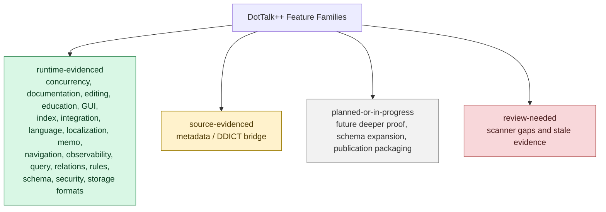

## Runtime Proof Gate

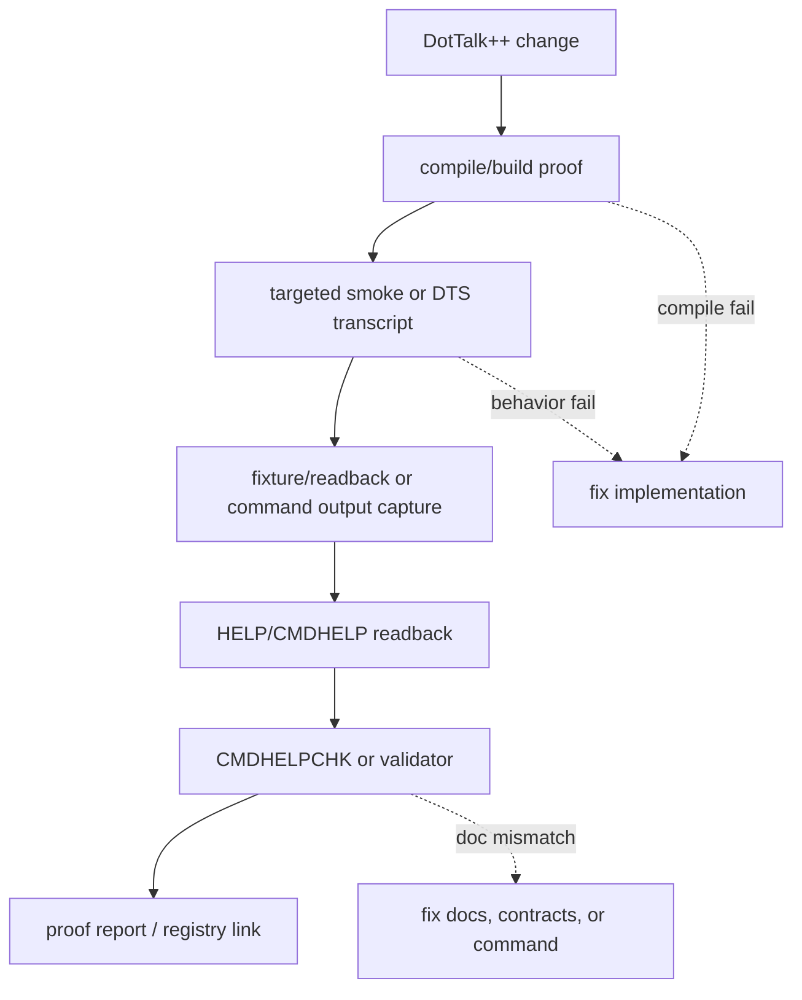

## Maintenance Lane Map

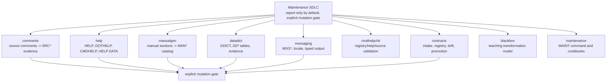

## Runtime Risk Classes

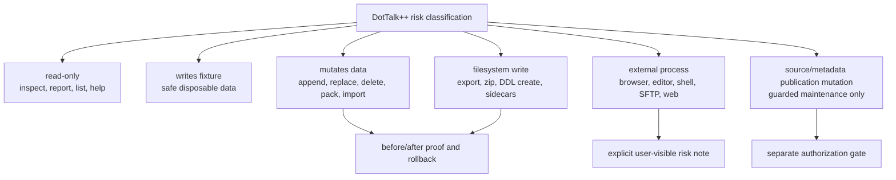

## Profiles and Boundaries

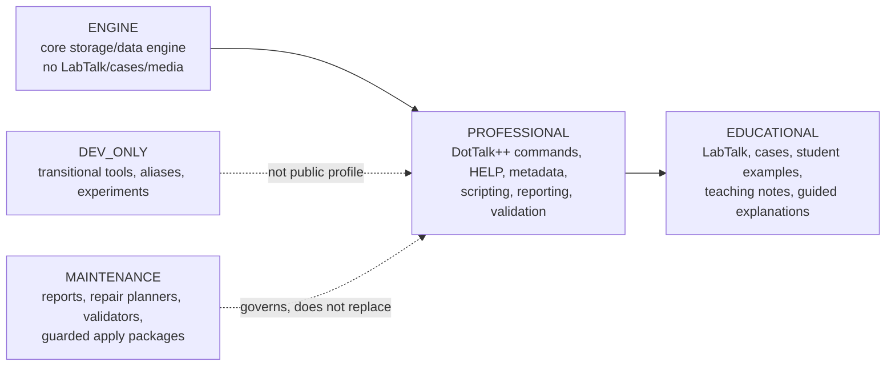

## DotTalk++ / LabTalk / PLDC Boundary

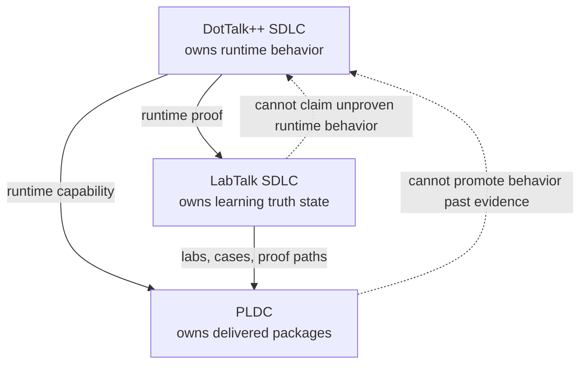

## First Operational Board

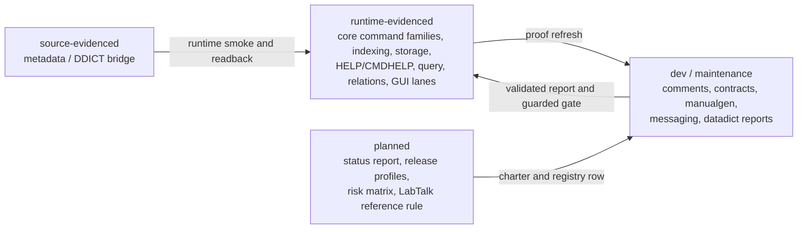
