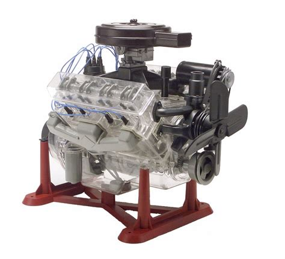
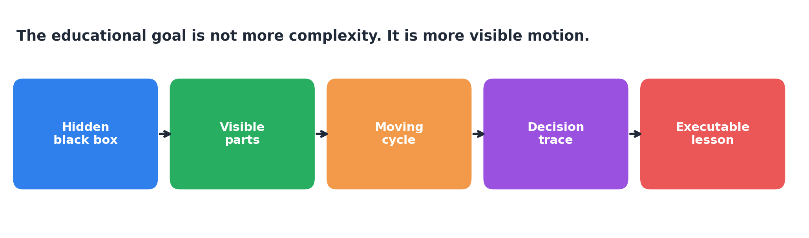
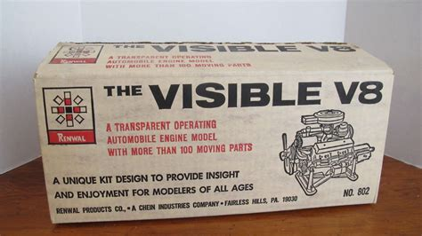
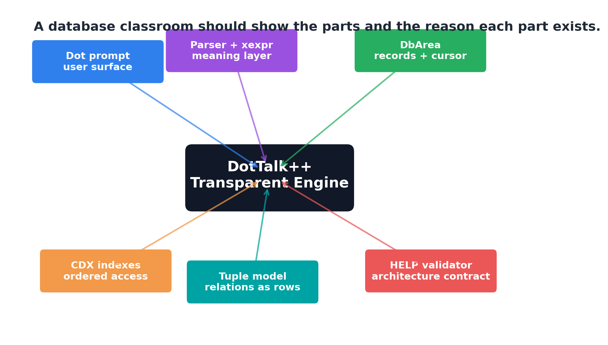
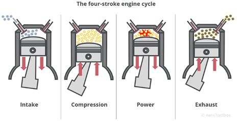
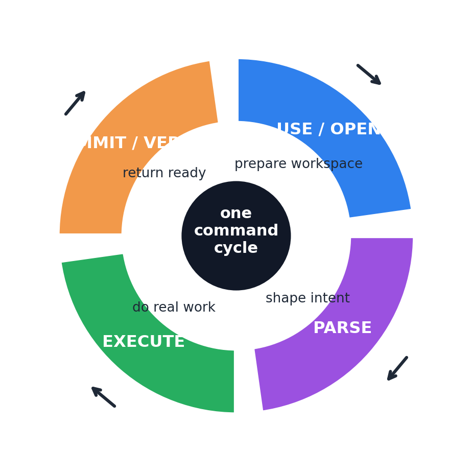
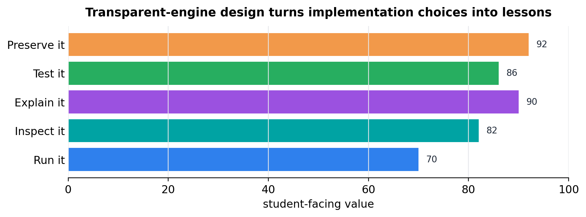

**TRANSPARENT ENGINE**

**From the Visible V-8 to DotTalk++ as an educational database environment**

*Original project image retained from the Visible Engine Codex draft.*

| **Central idea:** A transparent plastic engine taught because it let students see motion that is normally hidden. DotTalk++ can do the same for software: expose records, indexes, expressions, relations, errors, and design choices as visible parts of a working machine. |
|----|

The old model engine did not simplify the engine by pretending it had no complexity. It simplified learning by making the complexity visible, ordered, and safe to inspect. That is the strongest version of the DotTalk++ educational vision.

This shorter version keeps the metaphor, but cuts the catalog. The point is not to map every nut and screw. The point is to show how a student can watch a command enter the engine, move through decisions, touch storage, and come back as a verified result.

**1. From clear plastic to clear architecture**

A visible engine is powerful because it changes the student question from "what happened?" to "where did it happen, and why?" That same shift is the heart of an educational database engine.

| **Visible V-8 teaching move** | **DotTalk++ teaching move** |
|----|----|
| Transparent housing exposes moving parts. | Command surfaces expose parser, expression, storage, index, relation, and output stages. |
| Crank, pistons, valves, and timing can be watched together. | DbArea, xexpr, CDX, tuple rows, HELP validation, and output can be traced as one cycle. |
| A child can turn the crank slowly and inspect sequence. | A student can run, step, inspect, rebuild, and verify without hiding the engine. |
| The model is safe to misunderstand and retry. | The environment should make mistakes recoverable, explainable, and teachable. |

| **AI angle:** The same transparency matters when AI helps build the system. A good AI partner should not just produce code; it should preserve intent, show tradeoffs, identify risks, and leave proof points behind. |
|----|

That makes DotTalk++ more than a command language. It becomes a teaching bench: an environment where the student sees not only the result, but also the structure and the reasoning that made the result trustworthy.

**2. The parts should teach the whole machine**

*The model engine image is kept because the visual metaphor is the document anchor.*

| **Engine idea** | **DotTalk++ part** | **What the student sees** |
|----|----|----|
| Block | DbArea and table storage | Records, cursor position, mutation, table flavor behavior. |
| Cam and timing | Scheduler and command discipline | Why order matters: USE before LIST, index before SEEK. |
| Valves | I/O boundaries | When data is read, written, flushed, or locked. |
| Ignition | Parser, xexpr, command dispatch | Where intent becomes executable action. |
| Display stand | Dot prompt, HELP, browser, reflection | A working engine that can also explain itself. |

| **Important restraint:** A metaphor should illuminate architecture, not replace it. When the mapping stops helping, the runtime evidence wins. |
|----|

**3. A command has a cycle**

The best educational comparison is the cycle, not the parts list. A four-stroke engine repeats a disciplined rhythm. DotTalk++ commands should be just as traceable.

|  |  |
|----|----|

*Original four-stroke image retained, paired with a DotTalk++ command-cycle diagram.*

| **Cycle phase** | **Engine action** | **DotTalk++ action** |
|----|----|----|
| Intake | Open gate; bring material in. | USE / open table, load schema, prepare workspace. |
| Compression | Shape energy before firing. | PARSE / validate tokens, names, types, and expression intent. |
| Power | Combustion turns motion into work. | EXECUTE / scan, seek, join, replace, calculate, or display. |
| Exhaust | Clear the cylinder for the next cycle. | COMMIT / flush, release locks, report, return to ready state. |

This is also where students learn discipline: commands are not magic phrases. They are requests that pass through a machine with sequence, state, constraints, and observable consequences.

**4. Design decisions can become lessons**

The strongest educational value in DotTalk++ is not only that it runs old-style commands. It is that implementation choices can be surfaced as teachable decisions.

| **Decision** | **What it protects** | **What it teaches** |
|----|----|----|
| DbArea owns records, cursor, mutation, and table flavor behavior. | Prevents storage leakage into the command surface. | Architecture boundaries matter. |
| xexpr is the shared expression engine. | Prevents each command from inventing its own evaluator. | Central logic is safer than scattered patches. |
| HELP is an executable contract, not just documentation. | Catches drift between claims and behavior. | Docs can validate the system. |
| Tuple rows are relation-aware and backend-neutral. | Keeps SQL, CSV, LabTalk, and UI work aligned. | A row model can bridge worlds. |
| Fixed structural schema plus resolved x64 metadata. | Keeps loading predictable while allowing richer headers. | Compatibility and modernization can coexist. |

| **Teaching prompt:** Do not only ask students to use a feature. Ask them what would break if the feature lived in the wrong layer. |
|----|

**5. What the transparent engine should become**

The end goal is a learning environment where the database can run, explain, and defend itself. A student should be able to move between command, data, index, relation, output, and design rationale without leaving the engine.

| **Student action** | **Engine response** |
|----|----|
| Watch | Show the command cycle and active work area. |
| Inspect | Expose records, fields, indexes, memo blocks, relations, and expression results. |
| Explain | Tell why the chosen subsystem owns the behavior. |
| Change | Let the student alter data or structure in a controlled way. |
| Verify | Run HELP checks, rebuild checks, schema checks, and before/after comparisons. |

| **Transparent Engine principle:** The machine should not hide its moving parts from the learner. It should make the parts visible enough to reason about, safe enough to experiment with, and honest enough to prove what actually happened. |
|----|

That is the difference between a black-box demo and an educational engine. The black box asks for trust. The transparent engine earns trust by showing structure, motion, decision, and evidence.

The Visible V-8 made combustion understandable by slowing it down and putting it behind clear plastic. DotTalk++ can make database architecture and AI-assisted software decisions understandable by slowing the command cycle down and putting the reasoning behind clear glass.

**The engine is visible. The architecture is teachable. Now let the student turn the crank.**

## Figures

