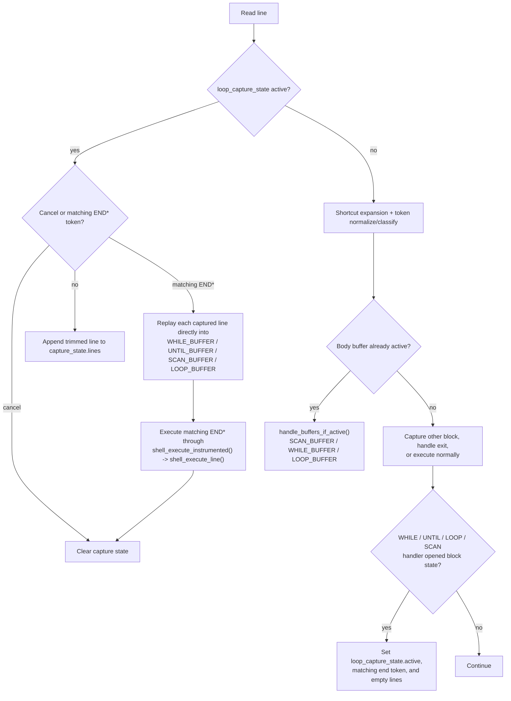

# DotTalk++ Shell Dispatch and Loop Capture v1

Status: source-evidenced development diagram
Verified: 2026-07-12
Owning lifecycle: DotTalk++ SDLC
SDLC lane: proof
Truth state: implementation-aligned
Proof state: static source inspection
Risk class: documentation-only
Next gate: runtime regression proof and publication review

These diagrams describe the authoritative development source in
`D:\code\ccode`. Public repository paths use `src/...`; CI checkout prefixes
such as `/home/runner/work/x64base/x64base` are deliberately omitted because
they are environment-specific rather than source authority.

## Interactive shell to command handler

```mermaid
flowchart LR
    U["User / script line"] --> RS["run_shell()<br/>src/cli/shell.cpp"]
    RS --> LC{"loop_capture_state active?"}

    LC -- yes --> CAP["Capture or close/replay loop block"]
    LC -- no --> SC["expand_shortcut_lead()"]
    SC --> TK["Normalize and classify first token"]
    TK --> BQ{"SCAN / WHILE / shared LOOP-UNTIL<br/>buffer active?"}

    BQ -- yes --> BUF["handle_buffers_if_active()<br/>SCAN_BUFFER / WHILE_BUFFER / LOOP_BUFFER"]
    BUF --> DSB[("Active body buffers")]

    BQ -- no --> BC{"Other shell block begins?"}
    BC -- yes --> BCS["Capture shell/browser block"]
    BC -- no --> EX["shell_execute_line()<br/>src/cli/shell_api.cpp"]

    EX --> PP["expand shortcut + preprocess_for_dispatch()<br/>SET RELATIONS / RELATIONS -> REL"]
    PP --> IFG{"IF-suppressed?"}
    IFG -- yes --> DROP["Accept and skip non-IF command"]
    IFG -- no --> VAR["try_handle_var_command()"]
    VAR --> MAC["expand_macros_outside_quotes()"]
    MAC --> REG["registry().run(command, args)"]
    REG --> CMD["Registered cmd_* handler<br/>src/cli/shell_commands.cpp"]
    CMD --> OUT["Output / side effects"]

    CMD --> SF["cmd_SETFILTER"]
    SF --> FREG[("filter registry<br/>per-DbArea expression AST")]
    FREG --> VIS["filter::visible()"]
    VIS --> QCMDS["Visibility-aware navigation and query commands"]
```

Important implementation distinctions:

- `run_shell()` performs an initial shortcut expansion for interactive routing;
  `shell_execute_line()` performs canonical shortcut expansion and dispatch
  preprocessing.
- `handle_buffers_if_active()` routes active `UNTIL` through the shared
  `LOOP_BUFFER`; `UNTIL_BUFFER` is used by captured replay.
- The filter branch is a downstream behavioral relationship, not a claim that
  every command calls `filter::visible()` directly.

## Interactive loop capture and replay

The replay loop invokes the concrete buffer functions directly. The matching
`END*` line then returns through the instrumented canonical command path and
the capture state is cleared.

## Static source evidence

- `src/cli/shell.cpp`: interactive ordering, capture/replay, and block opening
- `src/cli/shell_api.cpp`: canonical preprocessing, IF suppression, variables,
  macro expansion, and registry dispatch
- `src/cli/shell_api_extras.cpp`: relation-command preprocessing
- `src/cli/shell_buffer_utils.cpp`: active-buffer routing
- `src/cli/shell_commands.cpp`: command registrations including filter and
  scripting handlers

Static inspection establishes implementation alignment, not runtime behavior.
The next SDLC gate is a targeted regression transcript covering shortcut,
relation preprocessing, IF suppression, each loop form, and filter-aware
visibility.
