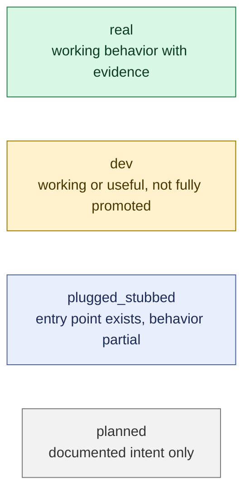
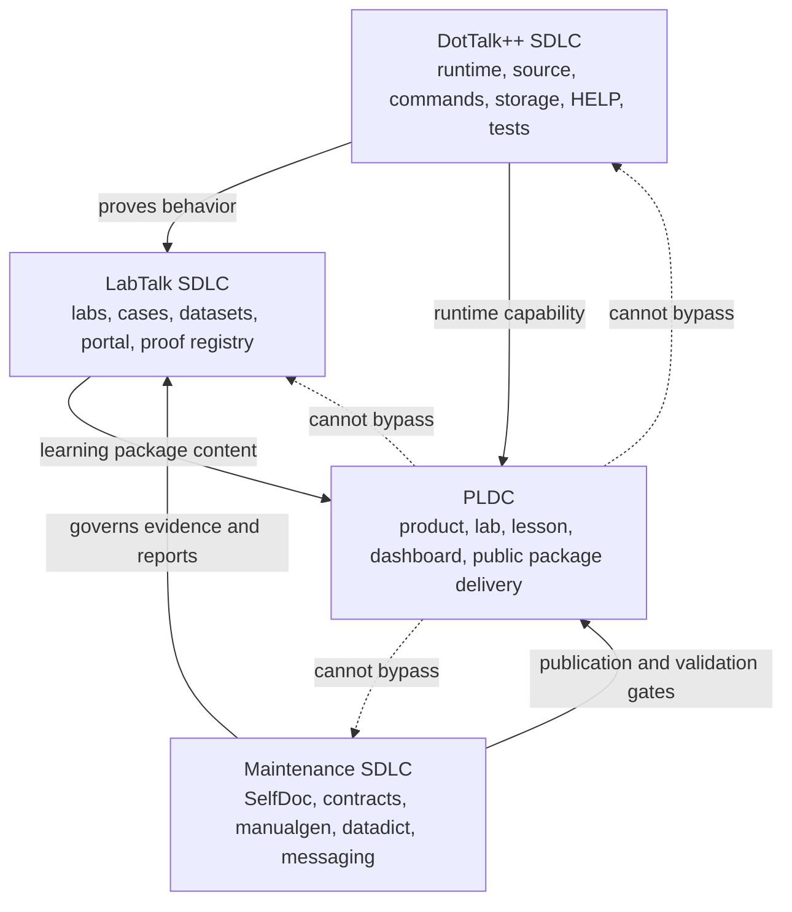
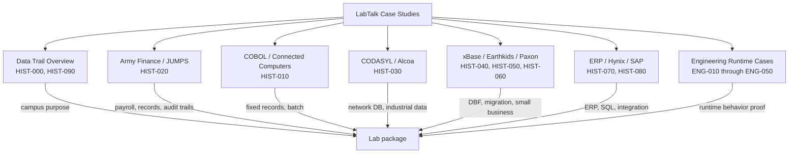
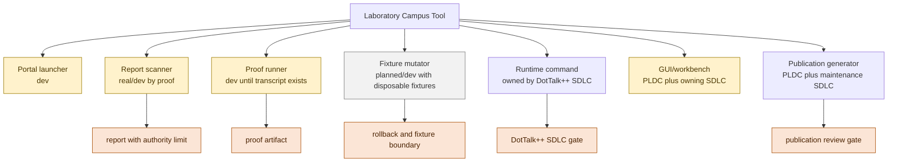
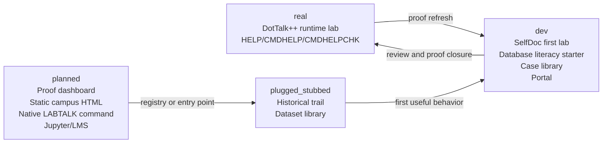

# LabTalk SDLC Diagrams v0

Status: draft diagram pack
Created: 2026-07-04
Purpose: visual view of the Laboratory Campus SDLC by real, dev, plugged/stubbed, and planned state

## State Legend

## Current Campus State Map

```mermaid
flowchart TB
    campus["LabTalk Laboratory Campus"]

    runtime["DotTalk++ Runtime Systems Lab<br/>real"]
    help["HELP / CMDHELP / CMDHELPCHK Lab<br/>real"]

    selfdoc["Self-Documenting Systems Lab<br/>dev"]
    dblit["Database Literacy Starter<br/>dev"]
    cases["Case Library<br/>dev"]
    portal["LabTalk Portal<br/>dev"]

    history["Historical Data Systems Trail<br/>plugged_stubbed"]
    datasets["Dataset Library<br/>plugged_stubbed"]

    proofdash["Proof Dashboard<br/>planned"]
    staticweb["Static Campus HTML Snapshot<br/>planned"]
    nativecmd["Native LABTALK command<br/>planned"]
    notebooks["Jupyter / LMS Delivery<br/>planned"]

    campus --> runtime
    campus --> help
    campus --> selfdoc
    campus --> dblit
    campus --> cases
    campus --> portal
    campus --> history
    campus --> datasets
    campus --> proofdash
    campus --> staticweb
    campus --> nativecmd
    campus --> notebooks

    classDef real fill:#d9f7e5,stroke:#1d7f45,color:#0b3d20
    classDef dev fill:#fff2cc,stroke:#9a7a00,color:#4a3600
    classDef stub fill:#e8eefc,stroke:#4b62a3,color:#1d2b57
    classDef planned fill:#f2f2f2,stroke:#777,color:#333
    classDef root fill:#ffffff,stroke:#111,color:#111

    class campus root
    class runtime,help real
    class selfdoc,dblit,cases,portal dev
    class history,datasets stub
    class proofdash,staticweb,nativecmd,notebooks planned
```

## Promotion Flow

```mermaid
flowchart LR
    idea["idea / intake"]
    planned["planned"]
    stub["plugged_stubbed"]
    dev["dev"]
    real["real"]
    student["student_ready"]
    publish["publication_ready"]

    idea --> planned
    planned -->|"registry row or entry point exists"| stub
    planned -->|"runnable implementation exists"| dev
    stub -->|"useful behavior plus run evidence"| dev
    dev -->|"runtime/source/doc evidence linked"| real
    real -->|"reviewed setup, safety, expected results"| student
    student -->|"publication, source, fact, media review"| publish

    real -. "stale proof or drift" .-> dev
    dev -. "stubbed behavior found" .-> stub
    stub -. "entry point removed" .-> planned

    classDef planned fill:#f2f2f2,stroke:#777,color:#333
    classDef stub fill:#e8eefc,stroke:#4b62a3,color:#1d2b57
    classDef dev fill:#fff2cc,stroke:#9a7a00,color:#4a3600
    classDef real fill:#d9f7e5,stroke:#1d7f45,color:#0b3d20
    classDef ready fill:#dff5ff,stroke:#287c9b,color:#123b4a

    class planned planned
    class stub stub
    class dev dev
    class real real
    class student,publish ready
```

## SDLC, PLDC, and Ownership Split

## Case Study Lifecycle

```mermaid
flowchart LR
    memory["source_memory"]
    source["source_document_seen"]
    draft["normalized_case_draft"]
    readable["runtime_readable"]
    labcase["lab_candidate"]
    reviewed["reviewed_case"]
    student["student_case"]
    publication["publication_case"]

    memory --> source
    source --> draft
    draft --> readable
    readable --> labcase
    labcase --> reviewed
    reviewed --> student
    student --> publication

    draft -. "loader/readback only;<br/>not proof of history" .-> readable
    labcase -. "needs learning objective,<br/>dataset/tool path, proof plan" .-> reviewed
```

## Case Study Clusters

## Tool Lifecycle

## First Operational Board

