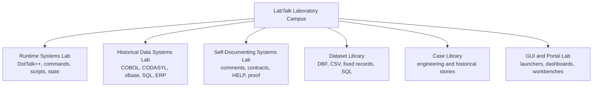
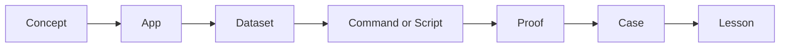
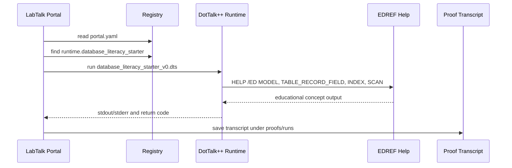
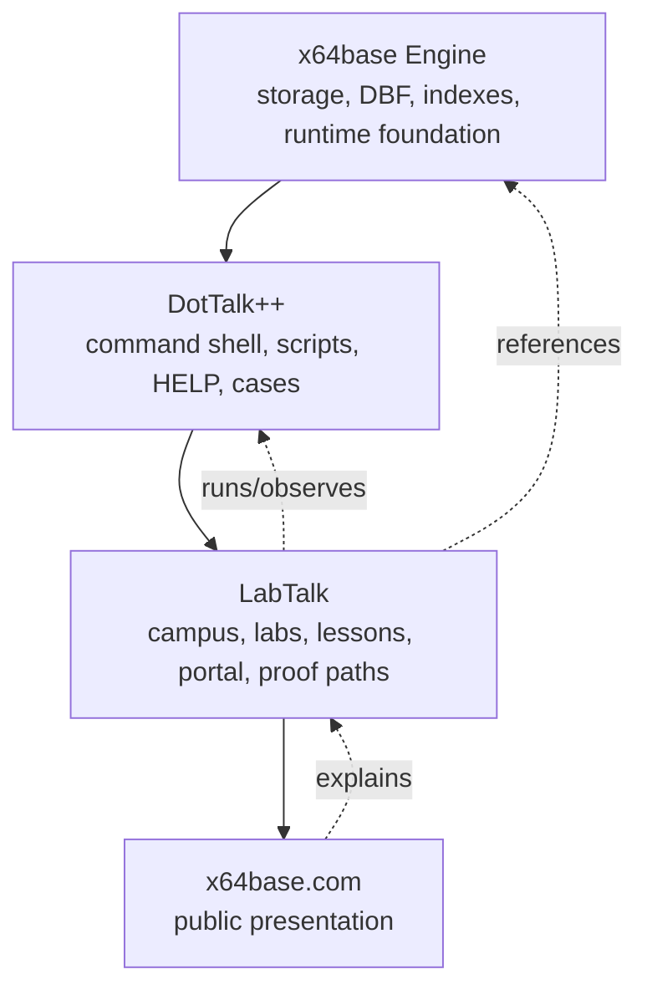

# LabTalk Visuals v0

Status: draft visual pack
Purpose: reusable diagrams for presenting LabTalk as a Laboratory Campus

## Curated Ecosystem Relationship Map

Use this as the current source-derived boundary map for x64base engine services,
DotTalk++, DotScript, evidence, SelfDoc/MDO/manualgen, reviewed publication, and
the Laboratory Campus consumer layer.

- Source: `x64base_dottalkpp_campus_relationship_map_v1.mmd`
- Notes and source basis: `X64BASE_DOTTALKPP_CAMPUS_RELATIONSHIP_MAP_v1.md`

This v1 map supersedes the simpler boundary sketch below when authority or
development status matters. The older sketch remains useful as a compact
historical visual.

## Campus Map

Use this when explaining LabTalk at the highest level.

## Proof Path

Use this when explaining what makes LabTalk different from ordinary lesson
material.

## Mermaid: Campus Model

## Mermaid: LabTalk Learning Chain

## Mermaid: First Working Slice

## Mermaid: Boundary Model

